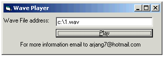



## Absolute Wave Player

### Description

This code will show you how to play wave sounds without using any components and just by calling an Api function
 
### More Info
 
New users always like to ad fansy stuffs to their software and adding sounds is exactly that.

Not at all

             |
---                |---
**Submitted On**   |1998-09-01 23:54:58
**By**             |[Arjang](https://github.com/Planet-Source-Code/PSCIndex/blob/master/ByAuthor/arjang.md)
**Level**          |Intermediate
**User Rating**    |4.7 (66 globes from 14 users)
**Compatibility**  |VB 6\.0
**Category**       |[Windows API Call/ Explanation](https://github.com/Planet-Source-Code/PSCIndex/blob/master/ByCategory/windows-api-call-explanation__1-39.md)
**World**          |[Visual Basic](https://github.com/Planet-Source-Code/PSCIndex/blob/master/ByWorld/visual-basic.md)
**Archive File**   |[CODE\_UPLOAD9517922000\.zip](https://github.com/Planet-Source-Code/arjang-absolute-wave-player__1-11180/archive/master.zip)

